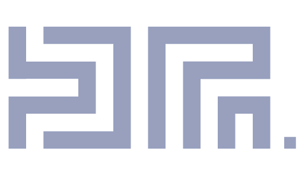

 <h1>I am DeveloperPrince </h1>

---
     
    

            
 
        
---

    <h3 style="text-align: center;"><strong>I am a DevOps Consultant </strong>
        <strong>based in Bulawayo.
        </strong>
    </h3>
    
I have been a Web Developer for 10 years now but have had 7 year experience professionally with The Techvillage. I was initially a Dotnet Developer then quickly ascending to Web Development using python and nodejs as my main languages for web development, python for data analysis. I have had experience in website building and web development using java, nodejs, svelte and css . I have also basic proficient experience on C++ for embedded system design using arduino. Currently focused on promoting adoption of DevOps in Industry by first starting with adoption of DevOps culture for small business, and Startups.

    
Currently DevOps Consult at an agency know as <strong><a href="https://initd-production.netlify.app/">Init-it</a></strong>, having <strong>ABSA</strong> the client I am actively invloved with working with <strong><a href="https://bankinginnovation.qorusglobal.com/absa-regional-operations-aro-digital-transformation">ABSA ARO</a></strong> . I am architectural, DevOps Specialist in the agency and I also coordinate micro projects within the agency. I use my engineering Industrial engineering background to rapidly proto type and experiment on new industrial exploration in the startup resulting me being process flow automation technician.

    
I am currently working with an application team called Digital Wallet , though I have a technical background I do offer my assisatnce to the ARO Openshift Engineering team in cases where extra hand is required.

    
Currently I am actively providing mentorship for who ever seeks to be a software engineer, if I am working with more than 2 developers who seek mentorship I make use of the Dreyfus Model of Skill acquisition (Dreyfus Model of Skill acquisition)

    

        <h2>More About Me</h2>
        
I am crazy about trying out new tech and always breaking the barriers of conventional technology. Hence I follow industry greats and inspirators like Rober C Martin, Martin Fowler, Simon Brown, Satya Nadella, Jensen Huang, Dr Lisa Su, Dr Kernan Mzelikahle, Paul Maposa (My Dad), Dr Jordan Peterson, Robert Greene
 
I also love reading Technical Based Books, which will help me in developing my craft in DevOps and Software engineering. The great man who have insipred me together with books have influenced me heavily on the way I few software and think.

    

    

        
    

    

    
Some of the reads include programming technical manuals and the books are as follows:

        <ul>
            <li>Think Fast,and slow</li>
            <li>Hit Refresh</li>
            <li>Accelerate: The Science of DevOps</li>
            <li>The Phoenix Project A Novel about IT, DevOps, and Helping Your Business</li>
            <li>Clean Code</li>
            <li>Clean Architecture: A Craftsman's Guide to Software Structure and Design</li>
            <li>12 Rules of Life</li>
            <li>The 48 Laws of Power</li>
            <li>The Prince</li>
            <li>The Art of War</li>
        </ul>
    

    

        <h3>ABSA Organizational Projects: </h3>
        <ul>
            <li><a href="https://github.com/absa-group/digital-wallet-deployment-tool">Digital Wallet Deployment Tool</a></li>
            <li><a href="https://github.com/absa-group/aro-admin-dev-authentication-service">Aro Admin SSO Demo Service [Springboot]</a></li>
            <li><a href="https://github.com/absa-group/aro-admin-dev-inventory-service">Aro Inventory Demo Service [Springboot]</a></li>
            <li><a href="https://github.com/absa-group/openshift_authentication_token_retriever">Openshift Token Retriever Service [Production]</a></li>
        </ul>
    

    

        
    

### Reference

* 4 C Model Architecturing . *Avalaible from*: [https://c4model.com/](https://c4model.com/) [30 July 2023]
* Microservices . *Available from*: [https://martinfowler.com/articles/microservices.html](https://martinfowler.com/articles/microservices.html) [7 July 2023]
* Dreyfus Model of Skill acquisition. *Available from*: [https://www.mindtools.com/atdbxer/the-dreyfus-model-of-skill-acquisition](https://www.mindtools.com/atdbxer/the-dreyfus-model-of-skill-acquisition) [14 April 2022]

### Contact Me

**Email :** [Developer](mailto:prince.maposa@absa.africa)

**WhatsApp/Mobile :** [+263717983773](tel:+263717983773)
